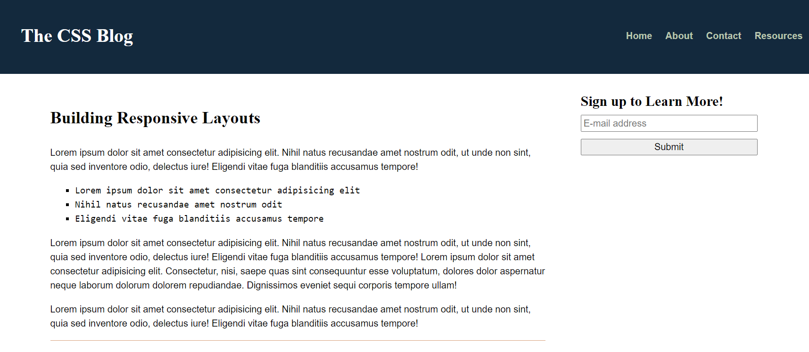

# 📖 Implement Typographic Styles

Work with a partner to implement the following user story:

* As a user, I want to read a blog that uses visually appealing font styles.

## Acceptance Criteria

* It's done when the body font has the standard size of 16px.
$ font_size: 16px;

* It's done when paragraphs have a line height of 1.5 times the font height.
$line-hight: 1.5 em

* It's done when headings are 150–200% of the font size and have a font family of `serif`.
h1 
$front-size: 2em
$margin: 2%
$ front-familly:serif

h2 
$front-size: 1.5 em
$margin: 2% 0

h3 
$front-size: 1.25em
$margin: 2%
$ front-familly:serif

p

$margin: 5% 0
$ front-familly:serif

aricle ul 
margin-left: 10%
list-style: square
front-familly: monospace

* It's done when there is a margin of 2–5% on the heading, paragraph, and list.

* It's done when the list is indented, has square bullet points, and has a font family of `monospace`.

* Working with CSS should be a creative experience for you! Your end product should look as close to the solution as possible, but feel free to try out other looks!

## 📝 Notes

Refer to the following documentation: 

[MDN Web Docs on fundamental text and font styling](https://developer.mozilla.org/en-US/docs/Learn/CSS/Styling_text/Fundamentals)

## Assets

The following image demonstrates the web application's appearance:

--- 

## 💡 Hints

* What values for `font-weight` and `font-style` can you use to give the page a more personal touch?

## 🏆 Bonus

If you have completed the activity and want to further your knowledge, work through the following challenge with your partner:

* What are some other options for web fonts besides the given basic fonts?

Use [Google](https://www.google.com) or another search engine to research this.

---
© 2024 edX Boot Camps LLC. Confidential and Proprietary. All Rights Reserved.
